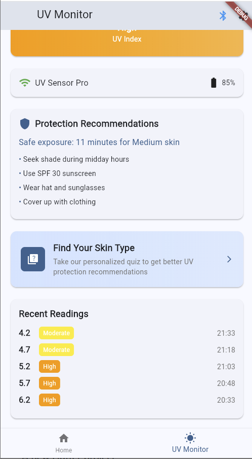
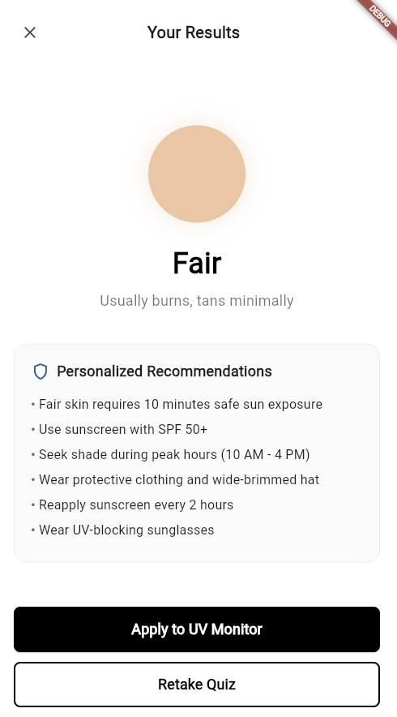

# UV Sense
## Week 1 Individual Project Report

**Personalized UV Monitoring & Protection**

Cross-Platform Development - ASE456

---

1. **Sprint 1 Demo**
   - Show working features from Sprint 1
   - Screen capture of your application demo

---

UV Monitor

---

Recent Readings

---

Find your skin type for personilized advice

---

Questions

---

Quiz results

---

2. **Sprint 1 Retrospective**
   - Project metrics: LoC, # of features, # of requirements, and burndown rate
   - What Went Wrong/Well with Analysis & Improvement Plan

---

- Total individual Lines of Code (LoC): ___1547___
- Number of individual features completed: ___2___
- Number of individual requirements completed: ___10___
- Individual burndown rate (%): ___50___

---

### What Went Wrong (Individual Level):
- BLE connection was harder than expected
- Hardware integration delayed - only mock device connections implemented
- Database persistence not yet implemented (using global variables temporarily)

---

### What Went Well (Individual Level):
- Good mock up of UV screen with professional UI/UX
- Included Fitzpatrick Skin quiz to get to know users sensitivity to UV
- Successfully implemented complete quiz flow with 11 questions
- Created comprehensive recommendation engine based on skin type and UV index
- Built reusable data models and mock data infrastructure

---

### Analysis & Improvement Plan (Individual Level):
- Research flutter and BLE more - need flutter_blue_plus package
- Implement actual database (SQLite) instead of global state
- Focus on hardware integration for Sprint 2
- Add historical data visualization charts

---

3. **Sprint 2 Goals**
   - What will you accomplish in Sprint 2
   - Project metrics: # of features and # of requirements
   - Updated timeline and milestones

---

### Individual Sprint 2 Goals:

- Implement actual BLE connectivity to ESP32 UV sensor hardware
- Add local database persistence (SQLite or Hive) for storing quiz results and UV readings
- Implement historical data visualization with charts (fl_chart package)
- Add background service for auto-logging UV readings
- Complete full hardware integration testing

---

### Individual Sprint 2 Metrics:

- Number of individual features planned: __2____
- Number of individual requirements planned: __7____

---

### Updated Individual Timeline:

- Week 1: Order/setup ESP32 hardware if not done, implement SQLite database for persistent storage
- Week 2: Implement flutter_blue_plus for BLE connectivity, test ESP32 sensor readings
- Week 3: Complete BLE data transmission, implement fl_chart for historical visualization
- Week 4: Add background service for auto-logging, final integration testing and bug fixes

---

### Key Individual Dates and Milestones:

- Individual presentation: During Sprint 2 (TBD)
- Individual milestones:
  - Database implementation: End of Week 1
  - BLE connectivity working: End of Week 2
  - Charts and visualization: End of Week 3
  - Full integration complete: End of Week 4